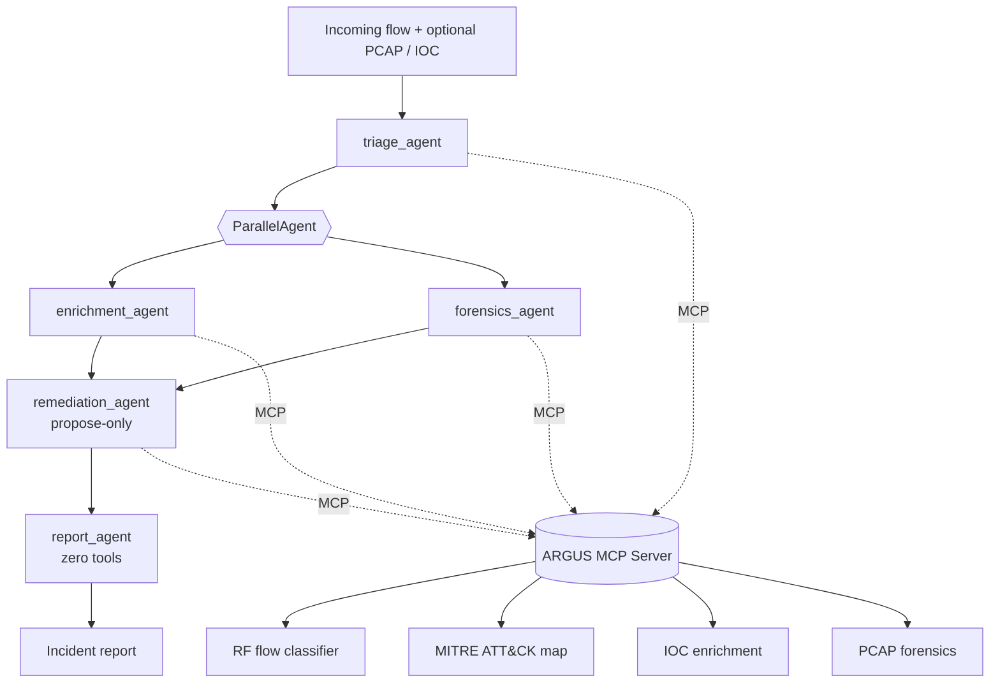

# ARGUS — Autonomous Response & Guarded Unified Security

**A multi-agent SOC co-pilot that detects, enriches, investigates, and reports network intrusions — built with Google ADK, a real MCP server, and security-by-design at every layer.**

This is the top-level workspace documentation and usage guide for **ARGUS**.

---

## 🏗️ Architecture & Flow

ARGUS coordinates several specialized agent roles to handle alert triage and investigation:



---

## 🚀 Quick Start (Zero Setup)

ARGUS is designed to run out-of-the-box. The Gemini API key is embedded inside [config.py](file:///c:/Users/suzum/Downloads/argus-soc-agent/argus/config.py), complete with self-healing model fallback chains and rate-limit retry logic.

### 1. Set Up the Environment
Activate the pre-configured virtual environment in the repository:

**On Windows (PowerShell):**
```powershell
.\venv\Scripts\Activate.ps1
```

**On Windows (CMD):**
```cmd
.\venv\Scripts\activate.bat
```

**On Linux/macOS:**
```bash
source venv/bin/activate
```

### 2. Install Dependencies
Install the `argus` package in editable mode from the repository root:
```bash
pip install -e ./argus
```

### 3. Generate Sample Data & Train the ML Model
Generate a synthetic network capture file (PCAP) and train the Random Forest flow classifier:
```bash
# Generate sample_portscan.pcap in argus/data/
python argus/scripts/make_sample_pcap.py

# Train the Random Forest model (runs grid search tuning)
python argus/scripts/train_model.py
```
*(Tip: You can use `python argus/scripts/train_model.py --fast` to skip hyperparameter tuning and train instantly.)*

---

## 🖥️ Running the Web Dashboard

The web dashboard provides a complete user interface to run both deterministic offline investigations and live Gemini multi-agent streams.

Start the FastAPI/Uvicorn server:
```bash
uvicorn argus.dashboard.app:app --reload --port 8000
```
Open your browser to **[http://localhost:8000](http://localhost:8000)**. 

From the header, you can toggle between:
- ⚡ **Offline Pipeline** — Instant, deterministic, zero API calls.
- 🧠 **Live Agent (Gemini)** — Real ADK multi-agent stream running against Gemini.

---

## 🛠️ CLI & Agent Skills

Every stage of the SOC investigation pipeline is also exposed as a standalone, scriptable "agent skill" via the `argus` CLI.

```bash
# Train the flow classifier
argus train

# Classify a random synthetic flow
argus detect --random

# Query threat intel (VirusTotal enrichment mock) for an IP
argus enrich 185.220.101.45

# Summarize a PCAP file's traffic
argus forensics argus/data/sample_portscan.pcap

# Look up MITRE ATT&CK techniques for a label
argus attack DDoS

# Propose remediation playbook
argus playbook DDoS --confidence 0.95

# Run the FULL offline pipeline investigation
argus investigate --random --pcap argus/data/sample_portscan.pcap --ip 185.220.101.45

# Run the FULL live multi-agent Gemini investigation
argus investigate --random --live

# Verify the audit log's cryptographic chain integrity
argus audit verify
```

---

## 🧪 Running Tests

To verify package integrity, run the unit test suite:
```bash
pytest -q argus
```
All 22 unit tests run offline, testing the flow detector, MITRE mappings, security guardrails, audit logging, and dashboard endpoints.

---

## 📁 Repository Directory Layout

*   [argus/agents/](file:///c:/Users/suzum/Downloads/argus-soc-agent/argus/agents/) - Multi-agent system orchestration (Google ADK).
*   [argus/cli/](file:///c:/Users/suzum/Downloads/argus-soc-agent/argus/cli/) - Command-line interface definition.
*   [argus/dashboard/](file:///c:/Users/suzum/Downloads/argus-soc-agent/argus/dashboard/) - FastAPI backend & static HTML/CSS frontend dashboard.
*   [argus/mcp_server/](file:///c:/Users/suzum/Downloads/argus-soc-agent/argus/mcp_server/) - FastMCP server exposing tools (PCAP analysis, threat intel, MITRE mappings).
*   [argus/ml/](file:///c:/Users/suzum/Downloads/argus-soc-agent/argus/ml/) - Synthetic feature generator and Random Forest model code.
*   [argus/security/](file:///c:/Users/suzum/Downloads/argus-soc-agent/argus/security/) - PII redaction, tool allowlists, prompt-injection checks, and hash-chained audit logging.
*   [argus/scripts/](file:///c:/Users/suzum/Downloads/argus-soc-agent/argus/scripts/) - Model training and PCAP generator scripts.
*   [argus/tests/](file:///c:/Users/suzum/Downloads/argus-soc-agent/argus/tests/) - Comprehensive offline test suite.
*   [argus/deploy/](file:///c:/Users/suzum/Downloads/argus-soc-agent/argus/deploy/) - Docker and Cloud Run deployment resources.
