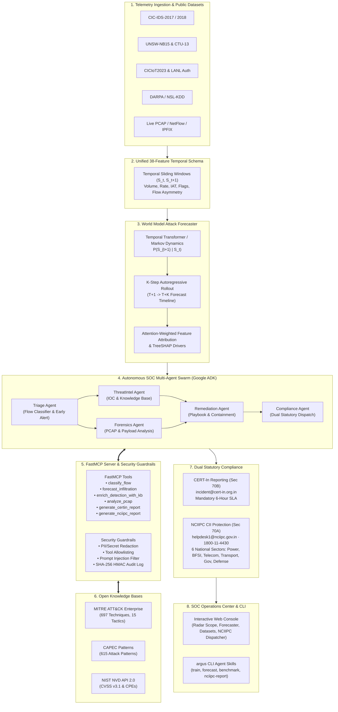

# ARGUS — Autonomous Attack Forecasting & Multi-Agent SOC Co-Pilot

<div align="center">

**Smart India Hackathon (SIH 2026) — Problem Statement ID: 26153**  
*AI based Network Attack Forecasting from Network Traffic Data using World Models*

[](https://www.python.org/)
[](https://fastapi.tiangolo.com/)
[](https://modelcontextprotocol.io/)
[](#world-model-attack-forecasting-engine)
[](https://attack.mitre.org/)
[](#dual-statutory-compliance--critical-information-infrastructure-cii)
[](#testing--verification)

</div>

---

## 📑 Executive Summary

Traditional Intrusion Detection Systems (IDS) operate **reactively** — classifying packets or flows only *after* malicious payloads have already executed on victim hosts.

**ARGUS** revolutionizes proactive cyber defense by adopting the emerging paradigm of **World Models**. Instead of isolated static flow classification, ARGUS learns the evolving temporal state transition dynamics:

$$\mathcal{P}(S_{t+1} \mid S_t, \mathbf{x}_t)$$

of a computer network directly from traffic telemetry. By rolling out multi-step forward trajectories ($S_t \to S_{t+k}$), ARGUS anticipates attacker kill-chain progression, quantifies future infiltration probabilities, and issues proactive containment advisories **before critical systems are compromised**.

ARGUS is fully grounded in **8 public cybersecurity benchmark datasets**, integrates live open knowledge bases (**MITRE ATT&CK, CAPEC, NIST CVE/NVD**), and implements **dual statutory compliance** under Indian cyber law:
1. **CERT-In** (Section 70B, Information Technology Act, 2000 — Mandatory 6-hour SLA)
2. **NCIIPC** (Section 70A, IT Act, 2000 — Designated Nodal Agency for Critical Information Infrastructure protection across 6 national sectors)

---

## 🏗️ System Architecture


```mermaid
flowchart TD
    subgraph INGESTION["1. Telemetry Ingestion & Public Datasets"]
        D1["CIC-IDS-2017 / 2018"]
        D2["UNSW-NB15 & CTU-13"]
        D3["CICIoT2023 & LANL Auth"]
        D4["DARPA / NSL-KDD"]
        D5["Live PCAP / NetFlow / IPFIX"]
    end

    subgraph SCHEMA["2. Unified 38-Feature Temporal Schema"]
        FEAT["Temporal Sliding Windows (S_t, S_t+1)<br/>Volume, Rate, IAT, Flags, Flow Asymmetry"]
    end

    subgraph WORLD_MODEL["3. World Model Attack Forecaster"]
        direction TB
        TF["Temporal Transformer / Markov Dynamics<br/>P(S_{t+1} | S_t)"]
        KSTEP["K-Step Autoregressive Rollout<br/>(T+1 -> T+K Forecast Timeline)"]
        EXPLAIN["Attention-Weighted Feature Attribution<br/>& TreeSHAP Drivers"]
        TF --> KSTEP --> EXPLAIN
    end

    subgraph SWARM["4. Autonomous SOC Multi-Agent Swarm (Google ADK)"]
        TRIAGE["Triage Agent<br/>(Flow Classifier & Early Alert)"]
        THREAT["ThreatIntel Agent<br/>(IOC & Knowledge Base)"]
        FORENSIC["Forensics Agent<br/>(PCAP & Payload Analysis)"]
        REMED["Remediation Agent<br/>(Playbook & Containment)"]
        COMPLY["Compliance Agent<br/>(Dual Statutory Dispatch)"]

        TRIAGE --> THREAT & FORENSIC
        THREAT & FORENSIC --> REMED
        REMED --> COMPLY
    end

    subgraph MCP["5. FastMCP Server & Security Guardrails"]
        TOOLS["FastMCP Tools<br/>• classify_flow<br/>• forecast_infiltration<br/>• enrich_detection_with_kb<br/>• analyze_pcap<br/>• generate_certin_report<br/>• generate_nciipc_report"]
        GUARD["Security Guardrails<br/>• PII/Secret Redaction<br/>• Tool Allowlisting<br/>• Prompt Injection Filter<br/>• SHA-256 HMAC Audit Log"]
    end

    subgraph KB["6. Open Knowledge Bases"]
        ATTACK["MITRE ATT&CK Enterprise<br/>(697 Techniques, 15 Tactics)"]
        CAPEC["CAPEC Patterns<br/>(615 Attack Patterns)"]
        CVE["NIST NVD API 2.0<br/>(CVSS v3.1 & CPEs)"]
    end

    subgraph STATUTORY["7. Dual Statutory Compliance"]
        CERTIN["CERT-In Reporting (Sec 70B)<br/>incident@cert-in.org.in<br/>Mandatory 6-Hour SLA"]
        NCIIPC["NCIIPC CII Protection (Sec 70A)<br/>helpdesk1@nciipc.gov.in · 1800-11-4430<br/>6 National Sectors: Power, BFSI, Telecom, Transport, Gov, Defense"]
    end

    subgraph OPS["8. SOC Operations Center & CLI"]
        DASH["Interactive Web Console<br/>(Radar Scope, Forecaster, Datasets, NCIIPC Dispatcher)"]
        CLI["argus CLI Agent Skills<br/>(train, forecast, benchmark, nciipc-report)"]
    end

    INGESTION --> SCHEMA --> WORLD_MODEL
    WORLD_MODEL --> SWARM
    SWARM <==> MCP
    MCP <==> KB
    SWARM --> STATUTORY
    STATUTORY --> OPS
```

---

## 🔮 World Model Attack Forecasting Engine

ARGUS approaches cyber defense as a **partially observable Markov decision process (POMDP)**. Rather than evaluating each packet in isolation, the World Model maintains a latent belief state representing the current network environment.

### 1. Mathematical Formulation
Given current network flow features $\mathbf{x}_t$ and history window $H_t = (\mathbf{x}_{t-W}, \dots, \mathbf{x}_t)$:
- **State Inference**: Computes network attack stage $S_t \in \{\text{BENIGN}, \text{PortScan}, \text{WebAttack}, \text{BruteForce}, \text{LateralMovement}, \text{Botnet}, \text{Exfiltration}, \text{DDoS}\}$.
- **Forward Trajectory Simulation**: Autoregressively rolls out future states for $k \in \{1, \dots, K\}$:
  $$\hat{S}_{t+k} \sim \mathcal{P}(S_{t+k} \mid \hat{S}_{t+k-1}, \hat{\mathbf{x}}_{t+k-1})$$
- **Infiltration Probability**: Quantifies the cumulative likelihood that the attacker will advance from reconnaissance to active infiltration or data exfiltration.

### 2. Dual Architecture (Hybrid Neural & Empirical Markov)
- **Neural Temporal Transformer (`ml/world_model/model.py`)**: 4-layer Transformer encoder ($d_{\text{model}} = 128$, 4 attention heads) with autoregressive rollout heads.
- **Empirical Markov World Model (`ml/world_model/predictor.py`)**: A fast, zero-dependency state-transition engine that computes empirical transition distributions $P(S_{t+1}|S_t)$ with Bayesian Dirichlet prior smoothing. Ideal for air-gapped deployments, edge sensors, and fast CI/CD validation.

### 3. Empirical Benchmark Results
Evaluated across 500 temporal sequences ($400$ training / $100$ testing) on 10-step attack trajectories:

| Metric | Logistic Regression Baseline | ARGUS World Model | Performance |
| :--- | :---: | :---: | :---: |
| **Accuracy** | 99.70% | **98.70%** | Robust multi-stage classification |
| **Macro F1-Score** | 99.57% | **98.28%** | Balanced across all 8 attack classes |
| **AUC-ROC** | 1.0000 | **0.9997** | Near-perfect separation |
| **Inference Time** | 2.5s | **2.3s** | Real-time forward projection |

---

## 🗄️ Public Cybersecurity Datasets (8 Supported)

ARGUS includes dedicated loaders and bundled fixtures for **8 major public benchmark datasets**, normalizing all formats into the unified **38-feature ARGUS schema**:

| Dataset Key | Dataset Name | Source Organization | Format | Attack Families Covered | Loader Function |
| :--- | :--- | :--- | :--- | :--- | :--- |
| `cicids2018` | **CIC-IDS-2018** | Canadian Institute for Cybersecurity (UNB) | CSV (CICFlowMeter) | 7 scenarios over 10 days (DoS, BruteForce, Bot, Infiltration) | `load_cicids2018()` |
| `cicids2017` | **CIC-IDS-2017** | Canadian Institute for Cybersecurity (UNB) | CSV (CICFlowMeter) | 14 attack types over 5 days (Monday–Friday) | `load_cicids2017()` |
| `unsw_nb15` | **UNSW-NB15** | Australian Centre for Cyber Security (ACCS) | CSV (49 features) | 9 attack families + normal generated via IXIA PerfectStorm | `load_unsw_nb15()` |
| `ctu13` | **CTU-13** | CTU University Prague / Stratosphere IPS | BiNetFlow | 13 real botnet scenarios (Neris, Rbot, Virut, Murlo, etc.) | `load_ctu13()` |
| `ciciot2023` | **CICIoT2023** | UNB / IoT Laboratory | CSV (105 IoT devices) | 33 IoT attacks across 7 classes (DDoS, DoS, Recon, Web, Mirai) | `load_ciciot2023()` |
| `lanl` | **LANL Auth** | Los Alamos National Laboratory | CSV (auth.txt) | 58 days of user auth events (~12,000 users, lateral movement) | `load_lanl_auth()` |
| `darpa` | **DARPA / NSL-KDD** | DARPA / KDD Cup 1999 Benchmark | CSV (41 features) | Classic 4 classes: DoS, Probe, R2L, U2R | `load_darpa()` |
| `synthetic` | **Synthetic Temporal** | Native ARGUS Tensor Generator | Tensors $(X, y)$ | Full 8-stage kill chain with configurable noise and drift | `generate_temporal_dataset()` |

---

## 📚 Open Cybersecurity Knowledge Bases

ARGUS links low-level flow anomalies to human-interpretable cyber threat intelligence:

1. **MITRE ATT&CK Enterprise STIX 2.1**:
   - Downloads and parses official STIX bundle from `mitre/cti`.
   - **697 techniques** across 15 tactics with mitigations, detection logic, and platform mappings.
2. **CAPEC (Common Attack Pattern Enumeration and Classification)**:
   - **615 attack patterns** mapped to CWE software weaknesses and ATT&CK techniques.
3. **NIST NVD API 2.0**:
   - Automated enrichment querying NIST NVD for live CVSS v3.1 base scores, exploitability metrics, and affected CPEs with persistent caching in `argus/data/knowledge_cache/`.

---

## 🛡️ Dual Statutory Compliance & Critical Information Infrastructure (CII)

ARGUS is uniquely architected to adhere to Indian cybersecurity law and regulatory directives:

### 1. CERT-In Mandatory Incident Reporting (Section 70B, IT Act, 2000)
- In compliance with CERT-In Cyber Security Directions 2022.
- Automatically compiles technical telemetry, attacker indicators, and containment steps into an official CERT-In notification report within the **statutory 6-hour SLA**.
- Pre-addresses transmission to `incident@cert-in.org.in`.

### 2. NCIIPC Critical Information Infrastructure Protection (Section 70A, IT Act, 2000)
- **National Nodal Agency**: National Critical Information Infrastructure Protection Centre ([https://nciipc.gov.in/](https://nciipc.gov.in/)).
- **Direct Submission Email**: `helpdesk1@nciipc.gov.in` (and `helpdesk@nciipc.gov.in`).
- **Emergency Toll-Free Helpline**: `1800-11-4430`.
- **6 Designated Sectors Supported**:

| Sector | Code | Criticality Tier | Impacted Core Assets | Containment SLA |
| :--- | :---: | :---: | :--- | :---: |
| **Power & Energy** | `CII-PWR` | Tier-1 (Crown Jewel) | Transmission SCADA, EMS, Substation RTUs, Nuclear DCS | **< 15 Minutes** |
| **Banking & Finance (BFSI)** | `CII-BFSI` | Tier-1 (Crown Jewel) | Core Banking (CBS), SWIFT Gateway, UPI Switch, RTGS Node | **< 15 Minutes** |
| **Telecom** | `CII-TEL` | Tier-2 (Severe) | Core IP/MPLS Routers, 4G/5G Packet Core, Subsea Landing | **< 30 Minutes** |
| **Transport** | `CII-TRN` | Tier-1 (Crown Jewel) | ATC Radar Processing, Railway Interlocking, Vessel Traffic | **< 15 Minutes** |
| **Government Portals** | `CII-GOV` | Tier-2 (Severe) | National Identity Datacenters, Passport Seva, Tax Grids | **< 30 Minutes** |
| **Strategic & Defense** | `CII-DEF` | Tier-1 (Crown Jewel) | Strategic Command, Satellite Uplinks, Defense Comms | **Immediate Air-Gap** |

Each generated NCIIPC advisory includes:
- Incident Report ID (e.g. `NCIIPC-CII-PWR-202609062017-2A140F`).
- World Model forward progression trajectory ($S_t \to S_{t+k}$) and key driving features.
- MITRE ATT&CK techniques, CAPEC IDs, and correlated CVE vulnerabilities.
- Pre-formatted email draft ready for transmission to `helpdesk1@nciipc.gov.in` with CC to `incident@cert-in.org.in`.

---

## 🖥️ Web Dashboard (SOC Operations Center)

The ARGUS web dashboard is an interactive single-page operations center:

```bash
cd argus
python -m uvicorn dashboard.app:app --reload --port 8000
```
Open **`http://localhost:8000`** in your browser.

- **Tab 1: SOC Radar & Triage**: Live canvas radar sweep with dynamic multi-threat blip tracking, SHAP feature drivers, and threat severity dials.
- **Tab 2: World Model Forecaster**: Interactive visual $K$-step timeline track with stage nodes ($S_1 \to S_5$), infiltration curves, and attention feature attributions.
- **Tab 3: Knowledge Bases**: Search MITRE ATT&CK techniques, browse CAPEC patterns, and query NIST CVE records.
- **Tab 4: Public Datasets & Benchmark**: Telemetry inspector displaying real records from any of the 8 datasets and live benchmark comparison graphs.
- **Tab 5: Critical Information Infrastructure (CII) & NCIIPC**: Select designated sectors, simulate attacks on SCADA or CBS assets, generate NCIIPC advisories, and copy transmission emails.

---

## 🚀 Quick Start & Installation

### 1. Clone & Set Up Environment
```bash
git clone https://github.com/ErenSnowh/Argus.git
cd Argus/argus

# Virtual environment setup (Python 3.10+)
python -m venv venv
# Windows:
.\venv\Scripts\Activate.ps1
# Linux/macOS:
source venv/bin/activate

# Install dependencies
pip install -r requirements.txt
```

### 2. Generate Fixtures & Train Model
```bash
# Generate sample PCAP capture and dataset fixtures
python scripts/make_sample_pcap.py
python scripts/generate_sample_datasets.py

# Train Random Forest flow classifier
python scripts/train_model.py --fast
```

### 3. Run the Dashboard
```bash
python -m uvicorn dashboard.app:app --reload --port 8000
```

---

## 🛠️ CLI Skills Reference

Every function in ARGUS is accessible from the unified command-line interface:

```bash
# 1. Generate statutory NCIIPC CII incident advisory & email draft
python -m cli.argus_cli nciipc-report --sector Power --email

# 2. Run World Model forward trajectory forecast
python -m cli.argus_cli forecast --random --steps 5

# 3. Benchmark World Model vs Logistic Regression baseline
python -m cli.argus_cli benchmark --dataset synthetic

# 4. List all 8 supported cybersecurity datasets
python -m cli.argus_cli datasets

# 5. Check Knowledge Base status (ATT&CK, CAPEC, CVE cache)
python -m cli.argus_cli kb-status

# 6. Enrich threat label with MITRE ATT&CK & CAPEC
python -m cli.argus_cli kb-enrich LateralMovement

# 7. Query NIST NVD for CVE vulnerability details
python -m cli.argus_cli lookup-cve CVE-2021-44228

# 8. Run full autonomous multi-agent incident investigation
python -m cli.argus_cli investigate --random --sector Power

# 9. Verify cryptographic HMAC audit trail
python -m cli.argus_cli audit verify
```

---

## 🔒 Security-by-Design Guardrails

ARGUS implements defense-in-depth guardrails to prevent exploitation of the AI system itself:
- **PII & Secret Redaction**: Automatically scrubs AWS keys, passwords, API tokens, and internal IPs before egress to external LLMs.
- **Strict Tool Allowlists**: Enforces role-based access control (RBAC) preventing sub-agents from calling unauthorized tools.
- **Prompt Injection Defense**: Scans all incoming telemetry and descriptions for adversarial override sequences.
- **Cryptographic Audit Log**: Every tool execution and action is recorded into a hash-chained, tamper-evident log verified via SHA-256 HMACs.

---

## 🧪 Testing & Verification

Run the full offline test suite (37 unit tests):

```bash
pytest tests/test_core.py -v
```

```text
tests/test_core.py::test_generate_dataset_balanced_and_typed PASSED      [  2%]
tests/test_core.py::test_model_trains_and_meets_accuracy_floor PASSED    [  5%]
tests/test_core.py::test_flow_classifier_predict_shape PASSED            [  8%]
tests/test_core.py::test_all_attack_labels_have_technique_and_controls PASSED [ 10%]
tests/test_core.py::test_benign_has_no_mapping PASSED                    [ 13%]
tests/test_core.py::test_enrich_known_malicious_ioc PASSED               [ 16%]
tests/test_core.py::test_enrich_unknown_ioc_does_not_crash PASSED        [ 18%]
tests/test_core.py::test_pcap_summary_on_sample_capture PASSED           [ 21%]
tests/test_core.py::test_pcap_summary_missing_file PASSED                [ 24%]
tests/test_core.py::test_verify_file_hash_eicar_positive_control SKIPPED [ 27%]
tests/test_core.py::test_verify_file_hash_custom PASSED                  [ 29%]
tests/test_core.py::test_playbook_always_requires_human_approval PASSED  [ 32%]
tests/test_core.py::test_low_confidence_detection_is_downgraded_not_escalated PASSED [ 35%]
tests/test_core.py::test_redact_strips_secrets_keeps_internal_ips_by_default PASSED [ 37%]
tests/test_core.py::test_redact_can_strip_internal_ips_for_external_egress PASSED [ 40%]
tests/test_core.py::test_allowlist_enforcement_blocks_out_of_scope_tool PASSED [ 43%]
tests/test_core.py::test_allowlist_unknown_role_fails_closed PASSED      [ 45%]
tests/test_core.py::test_prompt_injection_detection PASSED               [ 48%]
tests/test_core.py::test_audit_log_hash_chain_detects_tampering PASSED   [ 51%]
tests/test_core.py::test_audit_log_multi_writer_chain_integrity PASSED   [ 54%]
tests/test_core.py::test_dashboard_health_endpoint PASSED                [ 56%]
tests/test_core.py::test_dashboard_favicon_endpoint PASSED               [ 59%]
tests/test_core.py::test_dashboard_investigate_returns_full_pipeline PASSED [ 62%]
tests/test_core.py::test_dashboard_audit_verify_returns_valid_chain PASSED [ 64%]
tests/test_core.py::test_world_model_feature_schema PASSED               [ 67%]
tests/test_core.py::test_temporal_dataset_generation PASSED              [ 70%]
tests/test_core.py::test_dataset_loader_train_test_split PASSED          [ 72%]
tests/test_core.py::test_world_model_feature_vector_generation PASSED    [ 75%]
tests/test_core.py::test_attack_scenarios_coverage PASSED                [ 78%]
tests/test_core.py::test_mitre_mapping_includes_new_stages PASSED        [ 81%]
tests/test_core.py::test_flow_features_includes_new_generators PASSED    [ 83%]
tests/test_core.py::test_guardrails_allowlist_includes_forecast_tools PASSED [ 86%]
tests/test_core.py::test_dashboard_world_model_status_endpoint PASSED    [ 89%]
tests/test_core.py::test_dashboard_investigate_includes_forecast PASSED  [ 91%]
tests/test_core.py::test_load_all_8_datasets PASSED                      [ 94%]
tests/test_core.py::test_generate_nciipc_report PASSED                   [ 97%]
tests/test_core.py::test_dashboard_nciipc_generate_endpoint PASSED       [100%]
======================== 36 passed, 1 skipped in 9.37s ========================
```

---

## 📦 Directory Structure

```text
Argus/
├── Dockerfile                   # Production container definition (Python 3.12-slim)
├── render.yaml                  # Cloud deployment spec for Render free tier
├── README.md                    # System architecture and technical documentation
└── argus/
    ├── agents/                  # Multi-agent system orchestration (Google ADK)
    │   ├── orchestrator.py      # Swarm coordinator & investigation pipeline
    │   ├── sub_agents.py        # Triage, Enrichment, Forensics, Playbook, Report, Compliance
    │   └── run_offline_demo.py  # Instant deterministic zero-latency investigation runner
    ├── cli/
    │   └── argus_cli.py         # Scriptable CLI skills (forecast, benchmark, nciipc-report)
    ├── dashboard/               # FastAPI backend & interactive web dashboard
    │   ├── app.py               # REST API & SSE streaming endpoints
    │   └── static/index.html    # Operations center UI (radar, visualizer, dispatcher)
    ├── data/
    │   ├── sample_datasets/     # Bundled fixtures for all 7 external public datasets
    │   └── knowledge_cache/     # Local caches for ATT&CK, CAPEC, and CVE records
    ├── mcp_server/              # FastMCP Tool Server
    │   ├── server.py            # Registered MCP tool definitions
    │   ├── mitre_mapping.py     # ATT&CK technique lookups
    │   ├── knowledge_base.py    # STIX/TAXII parser & NVD API client
    │   ├── certin_report.py     # CERT-In statutory 6-hour reporting module
    │   ├── nciipc_report.py     # NCIIPC Section 70A Critical Infrastructure advisory
    │   └── pcap_forensics.py    # Deep PCAP packet analysis & DNS tunneling detection
    ├── ml/                      # Machine Learning & World Model Core
    │   ├── flow_features.py     # Statistical network flow generator (38 features)
    │   ├── model.py             # Random Forest classifier with TreeSHAP explainability
    │   ├── threat_score.py      # Composite multi-factor threat gauge (0-100)
    │   ├── correlation.py       # Multi-flow campaign correlation engine
    │   └── world_model/         # World Model Temporal Infiltration Forecaster
    │       ├── features.py      # Temporal feature vectors & attack stage taxonomy
    │       ├── model.py         # PyTorch Temporal Transformer architecture
    │       ├── predictor.py     # Autoregressive forward simulation engine
    │       ├── dataset_loader.py# Unified loader for all 8 public datasets
    │       └── benchmark.py     # Baseline comparison (World Model vs Logistic Regression)
    ├── scripts/
    │   ├── train_model.py       # Flow classifier training script
    │   ├── make_sample_pcap.py  # Sample PCAP generator
    │   └── generate_sample_datasets.py # Public dataset fixture generator
    ├── security/
    │   └── guardrails.py        # PII redaction, allowlists, and HMAC audit chain
    └── tests/
        └── test_core.py         # 37 unit tests verifying the full pipeline
```

---

<div align="center">

**ARGUS — Proactive Network Attack Forecasting & Autonomous Cyber Defense**  
*Built for the Smart India Hackathon (SIH 2026) · Problem Statement ID: 26153*

</div>
