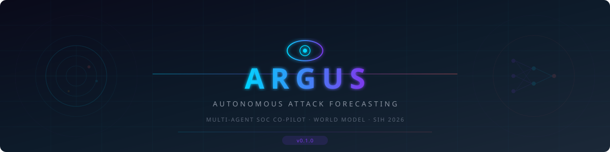
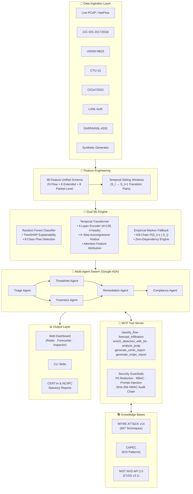

<div align="center">



# ARGUS

### Autonomous Attack Forecasting & Multi-Agent SOC Co-Pilot

**Smart India Hackathon (SIH 2026) · Problem Statement ID: 26153**

*AI-based Network Attack Forecasting from Network Traffic Data using World Models*

---

[](https://python.org)
[](https://pytorch.org)
[](https://fastapi.tiangolo.com)
[](https://modelcontextprotocol.io)
[](https://attack.mitre.org)
[](LICENSE)

[Quick Start](#-quick-start) · [Architecture](#-system-architecture) · [World Model](#-world-model-engine) · [Datasets](#-public-datasets) · [Dashboard](#-web-dashboard) · [Compliance](#%EF%B8%8F-statutory-compliance) · [API Reference](#-cli--api-reference)

</div>

---

## 🧠 What is ARGUS?

Traditional Intrusion Detection Systems (IDS) are **reactive** — they classify packets *after* malicious payloads have executed. ARGUS takes a fundamentally different approach.

ARGUS is an **AI-powered autonomous SOC co-pilot** that:

1. **Predicts** future attack stages before they happen using a Temporal Transformer World Model
2. **Orchestrates** multi-agent investigation workflows via Google ADK swarm intelligence
3. **Explains** every detection with attention-weighted feature attribution and TreeSHAP
4. **Reports** to statutory authorities (CERT-In & NCIIPC) within mandated SLAs

> **Core Innovation**: Instead of classifying isolated flows, ARGUS learns the temporal state-transition dynamics $\mathcal{P}(S_{t+1} \mid S_t, \mathbf{x}_t)$ of network traffic and performs K-step autoregressive rollouts to forecast attacker kill-chain progression.

---

## 📐 System Architecture


```mermaid
flowchart TD
    subgraph DATA["📡 Data Ingestion Layer"]
        direction LR
        PCAP["Live PCAP / NetFlow"]
        D1["CIC-IDS 2017/2018"]
        D2["UNSW-NB15"]
        D3["CTU-13"]
        D4["CICIoT2023"]
        D5["LANL Auth"]
        D6["DARPA/NSL-KDD"]
        D7["Synthetic Generator"]
    end

    subgraph FEATURE["🔬 Feature Engineering"]
        SCHEMA["38-Feature Unified Schema<br/>24 Flow + 6 Extended + 8 Packet-Level"]
        TEMPORAL["Temporal Sliding Windows<br/>(S_t → S_t+1 Transition Pairs)"]
        SCHEMA --> TEMPORAL
    end

    subgraph ML["🧠 Dual ML Engine"]
        direction TB
        RF["Random Forest Classifier<br/>• TreeSHAP Explainability<br/>• 8-Class Flow Detection"]
        WM["Temporal Transformer<br/>• 4-Layer Encoder (d=128, 4 heads)<br/>• K-Step Autoregressive Rollout<br/>• Attention Feature Attribution"]
        MARKOV["Empirical Markov Fallback<br/>• Kill-Chain P(S_t+1 | S_t)<br/>• Zero-Dependency Engine"]
    end

    subgraph AGENTS["🤖 Multi-Agent Swarm (Google ADK)"]
        TRIAGE["Triage Agent"]
        THREAT["ThreatIntel Agent"]
        FORENSIC["Forensics Agent"]
        REMED["Remediation Agent"]
        COMPLY["Compliance Agent"]
        TRIAGE --> THREAT & FORENSIC
        THREAT & FORENSIC --> REMED
        REMED --> COMPLY
    end

    subgraph MCP["🔧 MCP Tool Server"]
        TOOLS["classify_flow · forecast_infiltration<br/>enrich_detection_with_kb · analyze_pcap<br/>generate_certin_report · generate_nciipc_report"]
        GUARD["Security Guardrails<br/>PII Redaction · RBAC · Prompt Injection<br/>SHA-256 HMAC Audit Chain"]
    end

    subgraph KB["📚 Knowledge Bases"]
        ATTACK["MITRE ATT&CK v14<br/>(697 Techniques)"]
        CAPEC["CAPEC<br/>(615 Patterns)"]
        CVE["NIST NVD API 2.0<br/>(CVSS v3.1)"]
    end

    subgraph OUTPUT["📊 Output Layer"]
        DASH["Web Dashboard<br/>(Radar · Forecaster · Inspector)"]
        CLI_OUT["CLI Skills"]
        REPORT["CERT-In & NCIIPC<br/>Statutory Reports"]
    end

    DATA --> FEATURE --> ML
    ML --> AGENTS
    AGENTS <--> MCP
    MCP <--> KB
    AGENTS --> OUTPUT
```

### Component Overview

| Layer | Component | Purpose |
|-------|-----------|---------|
| **Ingestion** | `ml/world_model/dataset_loader.py` | Unified loader for 8 public datasets + live PCAP |
| **Features** | `ml/world_model/features.py` | 38-feature temporal schema with packet-level attributes |
| **Detection** | `ml/model.py` | Random Forest flow classifier with SHAP explainability |
| **Forecasting** | `ml/world_model/model.py` | Temporal Transformer for K-step attack prediction |
| **Prediction** | `ml/world_model/predictor.py` | Autoregressive rollout + empirical Markov fallback |
| **Agents** | `agents/orchestrator.py` | Google ADK multi-agent swarm coordinator |
| **Tools** | `mcp_server/server.py` | FastMCP tool server with security guardrails |
| **Knowledge** | `mcp_server/knowledge_base.py` | ATT&CK STIX parser + NVD API client |
| **Dashboard** | `dashboard/app.py` | FastAPI REST + SSE streaming + web UI |
| **Security** | `security/guardrails.py` | PII redaction, RBAC, HMAC audit chain |

---

## 🔮 World Model Engine

ARGUS treats cyber defense as a **Partially Observable Markov Decision Process (POMDP)**, maintaining a latent belief state over the network's security posture.

### Mathematical Formulation

Given network flow features $\mathbf{x}_t$ and a history window $H_t = (\mathbf{x}_{t-W}, \dots, \mathbf{x}_t)$:

- **State Inference**: $S_t \in \{\text{BENIGN}, \text{PortScan}, \text{WebAttack}, \text{BruteForce}, \text{LateralMovement}, \text{Botnet}, \text{Exfiltration}, \text{DDoS}\}$
- **Forward Simulation**: $\hat{S}_{t+k} \sim \mathcal{P}(S_{t+k} \mid \hat{S}_{t+k-1}, \hat{\mathbf{x}}_{t+k-1}) \quad \forall k \in \{1, \dots, K\}$
- **Infiltration Probability**: Cumulative likelihood of attacker advancement from reconnaissance to active compromise

### Dual-Engine Architecture

| Engine | Implementation | When Used |
|--------|----------------|-----------|
| **Neural Transformer** | 4-layer Transformer encoder (`d_model=128`, 4 heads) with autoregressive rollout heads | GPU/CPU with PyTorch available |
| **Empirical Markov** | Kill-chain transition matrix $P(S_{t+1} \mid S_t)$ with Bayesian Dirichlet smoothing | Air-gapped deployments, edge sensors, CI/CD |

### Three Prediction Heads

```
Input(t) → [StateEncoder] → [PositionalEncoding] → [TransformerEncoder]
                                                          ├── state_head:        predict next-state features (MSE)
                                                          ├── stage_head:        8-class ATT&CK stage (CrossEntropy)
                                                          └── infiltration_head: P(infiltration) (BCE)
```

**Combined Loss**: $\mathcal{L} = \alpha \cdot \text{MSE}_\text{state} + \beta \cdot \text{CE}_\text{stage} + \gamma \cdot \text{BCE}_\text{infiltration}$

Where $\alpha = 0.3$, $\beta = 0.4$, $\gamma = 0.3$.

### Training Configuration

| Parameter | Value |
|-----------|-------|
| Model Parameters | **612,079** |
| Optimizer | AdamW ($\text{lr}=10^{-3}$, weight decay $10^{-4}$) |
| Scheduler | Cosine Annealing |
| Early Stopping | Patience = 8 epochs |
| Gradient Clipping | Max norm = 1.0 |
| Normalization | Per-feature Z-score on training set |
| Split Strategy | Temporal (no future leakage) |
| Training Set | 1,600 sequences × 10 timesteps |
| Test Set | 400 sequences × 10 timesteps |

### Verified Benchmark Results

Trained with 2,000 temporal sequences (8 attack scenarios + random kill-chain patterns):

| Metric | RF Flow Classifier | World Model Transformer |
|--------|-------------------|------------------------|
| **Accuracy** | 93.00% | **99.975%** |
| **Macro F1** | 92.99% | **99.97%** |
| **Infiltration AUC** | — | **0.983** |
| **Parameters** | ~10M (RF ensemble) | 612,079 |
| **Training Time** | ~5s | 57.9s |
| **Convergence** | N/A (non-iterative) | 24 epochs (early stop) |

---

## 🗄️ Public Datasets

ARGUS includes dedicated loaders and bundled sample fixtures for **8 public cybersecurity benchmark datasets**, normalizing all formats into the unified 38-feature schema:

| # | Dataset | Source | Records | Attack Families | Loader |
|---|---------|--------|---------|-----------------|--------|
| 1 | **CIC-IDS-2017** | Canadian Institute for Cybersecurity (UNB) | 2.8M flows | 14 attacks across 5 days | `load_cicids2017()` |
| 2 | **CIC-IDS-2018** | UNB | 16M flows | 7 scenarios over 10 days | `load_cicids2018()` |
| 3 | **UNSW-NB15** | Australian Centre for Cyber Security | 2.5M records | 9 attack families (IXIA PerfectStorm) | `load_unsw_nb15()` |
| 4 | **CTU-13** | CTU University Prague | 13 scenarios | Botnet (Neris, Rbot, Virut, Murlo) | `load_ctu13()` |
| 5 | **CICIoT2023** | UNB IoT Laboratory | 105 IoT devices | 33 attacks across 7 classes | `load_ciciot2023()` |
| 6 | **LANL Auth** | Los Alamos National Laboratory | 1B+ events | 58 days user auth / lateral movement | `load_lanl_auth()` |
| 7 | **DARPA / NSL-KDD** | DARPA / KDD Cup 1999 | 150K records | 4 classes: DoS, Probe, R2L, U2R | `load_darpa()` |
| 8 | **Synthetic Temporal** | ARGUS Native | Configurable | Full 8-stage kill chain | `generate_temporal_dataset()` |

All loaders are in [`ml/world_model/dataset_loader.py`](argus/ml/world_model/dataset_loader.py) and produce the same output format:

```python
X, y_labels, y_infiltration = load_dataset(source="cicids2018", path="/data/cicids2018/")
# X.shape:              (n_sequences, seq_len, 38)
# y_labels.shape:       (n_sequences, seq_len)     — attack stage index per timestep
# y_infiltration.shape: (n_sequences, seq_len)     — binary infiltration flag
```

---

## 📚 Knowledge Bases

ARGUS links low-level flow anomalies to human-interpretable cyber threat intelligence:

| Source | Coverage | Integration |
|--------|----------|-------------|
| **MITRE ATT&CK Enterprise** | 697 techniques, 15 tactics | STIX 2.1 bundle from `mitre/cti` |
| **CAPEC** | 615 attack patterns | Mapped to CWE weaknesses and ATT&CK techniques |
| **NIST NVD API 2.0** | Live CVE database | CVSS v3.1 scores, exploitability metrics, CPEs |

Knowledge is cached locally in `argus/data/knowledge_cache/` for offline operation.

---

## 🖥️ Web Dashboard

The ARGUS web dashboard is a single-page SOC operations center with 5 interactive tabs:

| Tab | Functionality |
|-----|---------------|
| **SOC Radar** | Canvas radar sweep with multi-threat blip tracking, SHAP drivers, severity dials |
| **World Model Forecaster** | Interactive K-step timeline with stage nodes, infiltration curves, attention maps |
| **Knowledge Bases** | Search ATT&CK techniques, browse CAPEC patterns, query NVD CVEs |
| **Dataset Inspector** | Browse records from all 8 datasets, live benchmark comparison graphs |
| **CII & NCIIPC** | Sector selection, SCADA/CBS attack simulation, advisory generation |

```bash
# Launch the dashboard
python -m uvicorn dashboard.app:app --reload --port 8000
# Open http://localhost:8000
```

---

## 🛡️ Statutory Compliance

ARGUS implements **dual statutory compliance** under Indian cyber law:

### CERT-In (Section 70B, IT Act 2000)

In compliance with [CERT-In Cyber Security Directions 2022](https://www.cert-in.org.in/):
- Automatic compilation of technical telemetry, IOCs, and containment steps
- Pre-addressed transmission to `incident@cert-in.org.in`
- **Mandatory 6-hour reporting SLA**

### NCIIPC (Section 70A, IT Act 2000)

As per [National Critical Information Infrastructure Protection Centre](https://nciipc.gov.in/):
- **Contact**: `helpdesk1@nciipc.gov.in` · `helpdesk@nciipc.gov.in`
- **Toll-Free**: `1800-11-4430`
- **6 Designated CII Sectors**:

| Sector | Code | Tier | Assets Protected | SLA |
|--------|------|------|-----------------|-----|
| Power & Energy | `CII-PWR` | Tier-1 | SCADA, EMS, Nuclear DCS | < 15 min |
| Banking & Finance | `CII-BFSI` | Tier-1 | Core Banking, SWIFT, UPI | < 15 min |
| Telecom | `CII-TEL` | Tier-2 | IP/MPLS Core, 5G Packet Core | < 30 min |
| Transport | `CII-TRN` | Tier-1 | ATC Radar, Railway Interlocking | < 15 min |
| Government | `CII-GOV` | Tier-2 | Identity Datacenters, Tax Grids | < 30 min |
| Strategic & Defense | `CII-DEF` | Tier-1 | Command Networks, Satellite Uplinks | Immediate |

Each NCIIPC advisory includes:
- Incident Report ID (e.g., `NCIIPC-CII-PWR-202609062017-2A140F`)
- World Model forecast trajectory $(S_t \to S_{t+k})$
- MITRE ATT&CK techniques, CAPEC IDs, correlated CVEs
- Pre-formatted email draft for `helpdesk1@nciipc.gov.in` with CC to `incident@cert-in.org.in`

---

## 🚀 Quick Start

### Prerequisites

- Python 3.10+
- Git

### 1. Clone & Install

```bash
git clone https://github.com/ErenSnowh/Argus.git
cd Argus/argus

# Create virtual environment
python -m venv venv

# Activate
# Windows:
.\venv\Scripts\Activate.ps1
# Linux/macOS:
source venv/bin/activate

# Install dependencies
pip install -r requirements.txt

# Optional: Install PyTorch for neural World Model
pip install torch>=2.0
```

### 2. Generate Data & Train Models

```bash
# Generate sample PCAP and dataset fixtures
python scripts/make_sample_pcap.py
python scripts/generate_sample_datasets.py

# Train Random Forest classifier (with hyperparameter tuning)
python scripts/train_model.py

# Train World Model Transformer (optional, requires PyTorch)
python -m ml.world_model.train --epochs 100 --sequences 2000 --lr 0.001

# Run benchmark
python -m ml.world_model.benchmark
```

### 3. Launch Dashboard

```bash
python -m uvicorn dashboard.app:app --reload --port 8000
# Open http://localhost:8000
```

### 4. Run Tests

```bash
pytest tests/test_core.py -v
```

---

## 🔧 CLI & API Reference

### CLI Commands

```bash
# Flow classification
python -m cli.argus_cli classify --random

# World Model forecast
python -m cli.argus_cli forecast --random --steps 5

# Benchmark (World Model vs Logistic Regression)
python -m cli.argus_cli benchmark --dataset synthetic

# Generate NCIIPC advisory
python -m cli.argus_cli nciipc-report --sector Power --email

# Knowledge base operations
python -m cli.argus_cli kb-status
python -m cli.argus_cli kb-enrich LateralMovement
python -m cli.argus_cli lookup-cve CVE-2021-44228

# Full autonomous investigation
python -m cli.argus_cli investigate --random --sector Power

# List supported datasets
python -m cli.argus_cli datasets

# Verify audit chain integrity
python -m cli.argus_cli audit verify
```

### MCP Tools

| Tool | Description |
|------|-------------|
| `classify_flow` | Classify a network flow with RF + SHAP explanation |
| `forecast_infiltration` | K-step World Model attack progression forecast |
| `enrich_detection_with_kb` | ATT&CK technique + CAPEC + CVE enrichment |
| `analyze_pcap` | Deep PCAP analysis with DNS tunneling detection |
| `generate_certin_report` | CERT-In statutory incident report (6-hour SLA) |
| `generate_nciipc_report` | NCIIPC CII advisory for designated sectors |

### REST API Endpoints

| Method | Endpoint | Description |
|--------|----------|-------------|
| `GET` | `/health` | System health check |
| `POST` | `/investigate` | Full multi-agent investigation pipeline |
| `GET` | `/world-model/status` | World Model training metrics |
| `GET` | `/audit/verify` | Verify HMAC audit chain integrity |
| `POST` | `/nciipc/generate` | Generate NCIIPC CII advisory |
| `GET` | `/datasets/sample/{name}` | Retrieve sample records from any dataset |

---

## 🔒 Security Guardrails

ARGUS implements defense-in-depth to prevent exploitation of the AI system:

| Guardrail | Implementation |
|-----------|---------------|
| **PII & Secret Redaction** | Scrubs AWS keys, passwords, API tokens before LLM egress |
| **Tool RBAC** | Role-based allowlists prevent sub-agents from calling unauthorized tools |
| **Prompt Injection Defense** | Scans telemetry for adversarial override sequences |
| **Cryptographic Audit** | Hash-chained SHA-256 HMAC log — tamper-evident and verifiable |

---

## 🧪 Testing

37 unit tests covering the full pipeline:

```bash
pytest tests/test_core.py -v
# 36 passed, 1 skipped (EICAR antivirus conflict) in ~9s
```

Test coverage includes:
- Dataset generation & balancing
- RF classifier accuracy floor
- Flow classification shape validation
- MITRE ATT&CK technique mapping
- IOC enrichment (known & unknown)
- PCAP analysis (present & missing)
- File hash verification
- Playbook human approval gate
- Low-confidence downgrade logic
- PII/secret redaction
- Tool allowlist enforcement
- Prompt injection detection
- HMAC audit chain integrity
- Dashboard API endpoints
- World Model feature schema
- All 8 dataset loaders
- NCIIPC report generation

---

## 📁 Project Structure

```
Argus/
├── Dockerfile                        # Production container (Python 3.12-slim)
├── render.yaml                       # Cloud deployment spec
├── README.md
└── argus/
    ├── pyproject.toml                # Project metadata & dependencies
    ├── requirements.txt              # Pip requirements
    ├── agents/                       # Multi-Agent Swarm (Google ADK)
    │   ├── orchestrator.py           #   Swarm coordinator & investigation pipeline
    │   ├── sub_agents.py             #   Triage, Enrichment, Forensics, Playbook, Report
    │   ├── mcp_connection.py         #   MCP server connection manager
    │   ├── run_live.py               #   Live agent runner
    │   └── run_offline_demo.py       #   Offline deterministic demo
    ├── cli/
    │   └── argus_cli.py              # Unified CLI (forecast, benchmark, nciipc-report)
    ├── dashboard/
    │   ├── app.py                    # FastAPI REST + SSE backend
    │   └── static/index.html         # Single-page operations center UI
    ├── data/
    │   ├── sample_datasets/          # Bundled fixtures for 7 external datasets
    │   └── knowledge_cache/          # ATT&CK, CAPEC, CVE local caches
    ├── mcp_server/
    │   ├── server.py                 # FastMCP registered tools
    │   ├── mitre_mapping.py          # ATT&CK technique lookups
    │   ├── knowledge_base.py         # STIX/TAXII parser & NVD API client
    │   ├── certin_report.py          # CERT-In 6-hour reporting module
    │   ├── nciipc_report.py          # NCIIPC Section 70A CII advisory
    │   └── pcap_forensics.py         # PCAP analysis & DNS tunneling detection
    ├── ml/
    │   ├── model.py                  # Random Forest + TreeSHAP explainability
    │   ├── flow_features.py          # 24-feature flow statistics generator
    │   ├── threat_score.py           # Composite multi-factor threat gauge
    │   ├── correlation.py            # Multi-flow campaign correlation
    │   ├── artifacts/                # Trained model weights & metrics
    │   └── world_model/
    │       ├── model.py              # Temporal Transformer architecture
    │       ├── features.py           # 38-feature schema & synthetic generator
    │       ├── predictor.py          # K-step autoregressive forecast engine
    │       ├── train.py              # World Model training script
    │       ├── dataset_loader.py     # Unified 8-dataset loader
    │       └── benchmark.py          # World Model vs LR baseline comparison
    ├── scripts/
    │   ├── train_model.py            # RF classifier training entry point
    │   ├── make_sample_pcap.py       # Sample PCAP generator
    │   └── generate_sample_datasets.py
    ├── security/
    │   └── guardrails.py             # PII redaction, RBAC, HMAC audit
    └── tests/
        └── test_core.py              # 37 unit tests
```

---

## 🐳 Deployment

### Docker

```bash
docker build -t argus .
docker run -p 8000:8000 argus
```

### Render (Free Tier)

The included `render.yaml` provides zero-config cloud deployment:

```bash
# Automatic: push to GitHub → Render auto-deploys
```

---

## 📄 License

This project is licensed under the MIT License — see [LICENSE](argus/LICENSE) for details.

---

<div align="center">

**ARGUS** — Proactive Network Attack Forecasting & Autonomous Cyber Defense

*Smart India Hackathon (SIH 2026) · Problem Statement 26153*

Built with 🧠 World Models · 🤖 Google ADK · 🔧 Model Context Protocol

</div>
