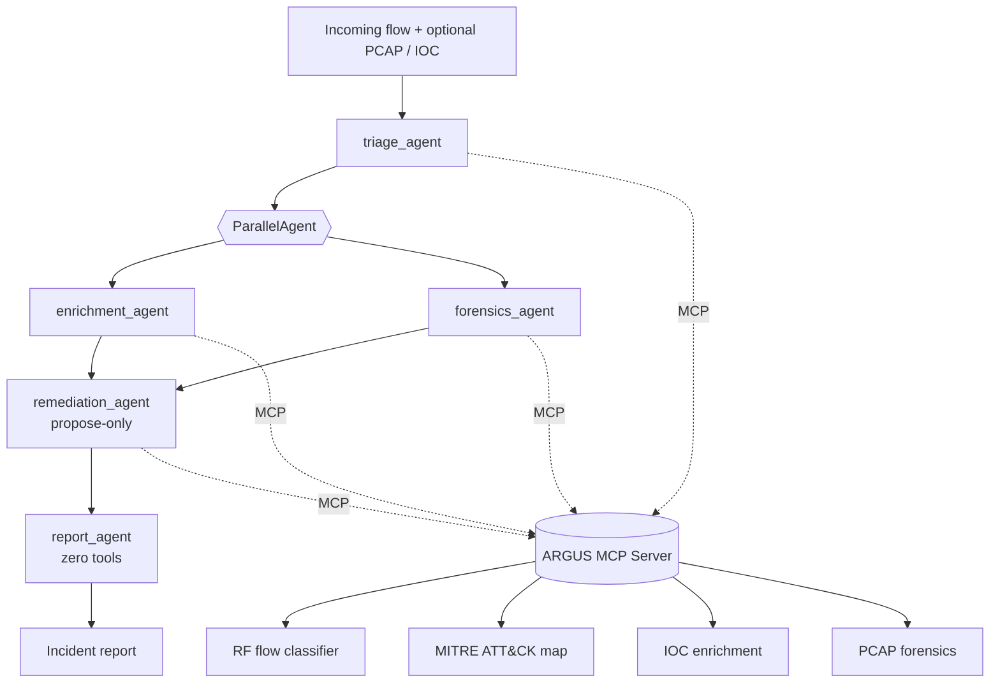

# ARGUS — Autonomous Response & Guarded Unified Security

**A multi-agent SOC co-pilot that detects, enriches, investigates, and reports network intrusions — built with Google ADK, a real MCP server, and security-by-design at every layer.**

> Built for the **Kaggle 5-Day AI Agents Intensive: Vibe Coding Course with Google** capstone — Track: **Agents for Business** (crossover: Agents for Good — protecting shared digital infrastructure).

[]() []() []() []()

---

## The problem

A SOC analyst's job, every time an alert fires, looks like this: decide if it's
real, pull threat intel on whatever IP/domain/hash is involved, look at the
underlying packet evidence, decide what to do, and write it up. Industry
surveys consistently put **alert fatigue** and **analyst burnout** near the
top of every CISO's list — most of that grind is repetitive triage, not the
genuinely hard judgment calls. That's the gap ARGUS targets: not "replace the
analyst," but **compress the 80% of the loop that's mechanical** so the human
spends their time on the 20% that actually needs a human.

This isn't a borrowed problem — it's the same pipeline (flow-feature
detection → MITRE ATT&CK mapping → IOC enrichment → forensic triage) the
author already builds by hand as an AI/ML security engineer; ARGUS is that
workflow, agentified.

## Why agents (not just a bigger ML model)

A classifier alone gives you a label and a confidence score. It can't decide
*what that label means*, go look up *whether the source IP has a reputation*,
*pull the packet evidence*, *draft a remediation plan*, and *write the
incident report* — that's a sequence of distinct judgment calls, several of
which can happen in parallel, each needing a different tool and a different
amount of trust. That's exactly the shape an agent swarm is good at, and
exactly the shape a single prompt or a single model is bad at.

## Architecture



Full diagram, security model, and key-concept-to-artifact mapping: **[docs/ARCHITECTURE.md](docs/ARCHITECTURE.md)**.

## Quick Start (zero setup — everything works out of the box)

```bash
pip install -r requirements.txt
python scripts/make_sample_pcap.py
python scripts/train_model.py
uvicorn dashboard.app:app --reload --port 8000
# open http://localhost:8000
```

The Gemini API key is **embedded in the repo** (`config.py`) — no `.env` file
or manual key setup needed. The dashboard has two modes:

- **⚡ Offline Pipeline** — instant, deterministic, zero API calls
- **🧠 Live Agent (Gemini)** — real ADK multi-agent pipeline streaming against Gemini

Toggle between them in the dashboard header.

## Run the real multi-agent ADK + Gemini pipeline (CLI)

```bash
# No API key setup needed — it's already embedded
python agents/run_live.py "Investigate this network flow: a single source IP made 200 short-lived TCP SYN connections to sequential destination ports within 16ms. PCAP at data/sample_portscan.pcap."
```

This streams every agent's reasoning and tool calls to stdout as the real ADK
`SequentialAgent`/`ParallelAgent` pipeline runs against Gemini. Includes
automatic retry with backoff for transient 503 errors.

## Agent Skills CLI

Every pipeline stage is also a standalone, scriptable "skill":

```bash
pip install -e .
argus train                                  # train the RF detector
argus detect --random                        # classify a synthetic flow
argus enrich 185.220.101.45                   # threat-intel lookup
argus forensics data/sample_portscan.pcap     # PCAP summary
argus attack DDoS                             # MITRE ATT&CK lookup
argus playbook DDoS --confidence 0.95         # propose remediation
argus investigate --random --pcap data/sample_portscan.pcap --ip 185.220.101.45
                                              # full offline pipeline
argus investigate --random --live             # full LIVE Gemini pipeline
argus audit verify                            # check audit-log tamper-evidence
```

## Testing

```bash
pip install -e ".[dev]"
pytest -q
```

22 tests covering the detector, MITRE mapping, IOC enrichment, PCAP
forensics, playbook generation, the dashboard's API error handling, and
every security guardrail (redaction, allowlist enforcement, prompt-injection
detection, audit-chain tamper detection, multi-writer chain integrity) — all
offline, no API key needed. Tests train into an isolated temp path and never
touch the production model artifact in `ml/artifacts/`. The LLM-driven agent
layer is exercised via `agents/run_live.py` against the embedded Gemini key; see
`docs/ARCHITECTURE.md` for why that layer isn't unit-tested the same way.

## Key concepts demonstrated

| Concept | Where |
|---|---|
| Agent / Multi-agent system (ADK) | `agents/sub_agents.py`, `agents/orchestrator.py` |
| MCP Server | `mcp_server/server.py` |
| Antigravity | Submission video |
| Security features | `security/guardrails.py` (redaction, least-privilege allowlists, prompt-injection sanitizing, hash-chained audit log) |
| Deployability | `deploy/` (Dockerfile, docker-compose, Cloud Run instructions) |
| Agent skills (Agents CLI) | `cli/argus_cli.py` |

## Project structure

```
config.py       Central config: auto-loads the Gemini API key
agents/         ADK LlmAgents + orchestrator + live/offline runners
mcp_server/     Real MCP server: detection, ATT&CK mapping, IOC enrichment, forensics, playbooks
ml/             Synthetic CICIDS2017-style data generator + Random Forest training/inference
security/       Redaction, tool allowlists, prompt-injection sanitizing, hash-chained audit log
cli/            `argus` Agent Skills CLI (with --live mode)
dashboard/      FastAPI backend + dark-mode dashboard (offline + live Gemini modes)
deploy/         Dockerfile, docker-compose, Cloud Run instructions
docs/           Architecture deep-dive
tests/          pytest suite (22 tests, offline)
scripts/        train_model.py, make_sample_pcap.py
```

## Design decisions worth knowing about

- **API key ships embedded.** The Gemini API key is baked into `config.py` so
  anyone who clones this repo can run the full live agent pipeline
  immediately. Override by setting `GOOGLE_API_KEY` in your environment.
- **Synthetic, not scraped, training data.** The full CICIDS2017 dataset is
  several GB and needs a manual download; `ml/flow_features.py` generates a
  reproducible synthetic dataset with the same feature philosophy (and
  intentionally injected noise, landing at a realistic ~94% accuracy instead
  of an unrealistic 100%) so the whole pipeline runs end-to-end with no
  external downloads. Swapping in real CICIDS2017 CSVs only requires
  changing the data source.
- **Remediation only ever proposes.** `remediation_agent` has a
  `propose_playbook` tool and explicitly does **not** have an
  `execute_playbook` tool — see `security/guardrails.TOOL_ALLOWLISTS`. An
  agent that can autonomously fire firewall rules is a bigger risk than most
  of the incidents it would catch.
- **Two run modes, one tool layer.** The offline dashboard and the live ADK
  pipeline call the *same* `mcp_server/*.py` functions — one through direct
  Python calls, one through the real MCP protocol — so the public demo is
  representative of the live system, not a separate mock.
- **Retry with backoff for 503.** Gemini can return 503 during high demand.
  `agents/run_live.py` automatically retries up to 3 times with exponential
  backoff.

## License

MIT — see [LICENSE](LICENSE).

