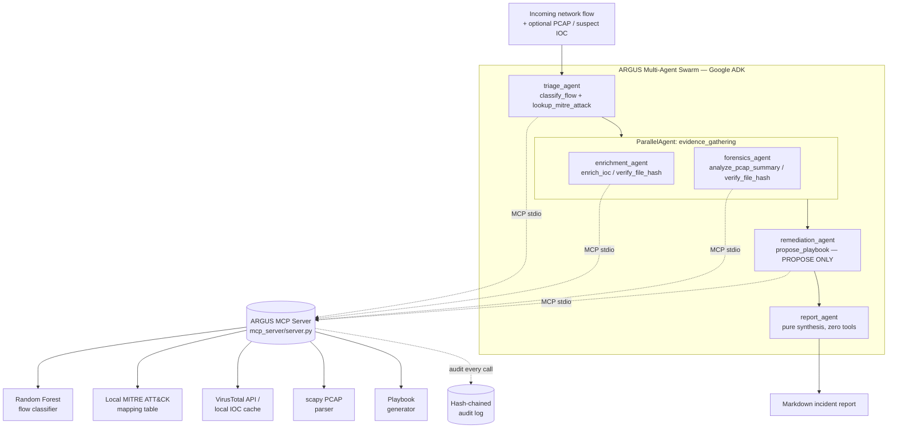

# ARGUS Architecture

## 1. What problem this solves

A SOC analyst doesn't just get an alert -- they have to (1) decide if it's
real, (2) pull threat intel on the indicators involved, (3) look at the
underlying packet/file evidence, (4) decide what to do about it, and (5)
write it up for the team and for compliance. That loop, done by hand, is
where most analyst hours (and most alert fatigue) go. ARGUS automates the
loop end-to-end -- and is explicit about the one step it deliberately does
**not** automate: actually pulling the trigger on a remediation action.

## 2. High-level pipeline

`triage_agent` runs first and decides, based on the predicted label and
confidence, whether the incident escalates at all -- most real network
traffic is benign and should stop right there, not fan out into a full
investigation.

## 3. Why a swarm instead of one big prompt

Each stage needs a different, narrow set of permissions and a different kind
of judgment:

- **Triage** needs to be fast and is the only stage that touches the raw
  statistical features directly.
- **Enrichment** and **forensics** are independent evidence streams (you
  don't need PCAP results to look up an IP's reputation, or vice versa) --
  hence `ParallelAgent`, not two sequential steps.
- **Remediation** should never see raw packet bytes or have any tool that
  could execute an action -- it only ever proposes.
- **Report** should never touch the network at all -- giving a
  pure-synthesis step tool access is unnecessary attack surface for zero
  benefit.

Splitting these into five narrow agents instead of one broad agent makes the
**security boundary legible**: you can read `security/guardrails.py`'s
`TOOL_ALLOWLISTS` and know exactly what each agent can and cannot do, instead
of trusting a single long system prompt to self-regulate.

## 4. Security-by-design (the "Security features" rubric item)

| Control | Where | What it prevents |
|---|---|---|
| Least-privilege tool allowlists, enforced at **both** the ADK toolset layer (`agents/mcp_connection.py`) and the MCP server layer (`mcp_server/server.py`) | defense in depth | An agent (or a prompt-injected agent) calling a tool outside its job, even if one layer is misconfigured |
| Secret/PII redaction before anything is logged or returned (`security/guardrails.redact`) | every MCP tool call | API keys, emails, and other sensitive strings leaking into logs or LLM context |
| Prompt-injection wrapping for untrusted text (`security/guardrails.sanitize_untrusted`) | report_agent's instructions explicitly tell it to treat tagged text as data, not instructions | Attacker-controlled filenames / payload strings / IOC results hijacking an agent's behavior |
| Hash-chained, append-only audit log (`security/guardrails.AuditLogger`) | every tool call across the MCP server and the offline pipeline | Silent tampering with the incident record after the fact -- `argus audit verify` recomputes the chain |
| `remediation_agent` has a "propose" tool, never an "execute" tool | `TOOL_ALLOWLISTS["remediation_agent"]` | An autonomous agent taking a real action (blocking an IP, isolating a host) without a human in the loop |
| `report_agent` gets zero tools | `TOOL_ALLOWLISTS["report_agent"] = set()` | Unnecessary network/tool access for a step that should only read and write text |

## 5. The two run modes

| | `agents/run_offline_demo.py` (+ `dashboard/`) | `agents/run_live.py` |
|---|---|---|
| Orchestration | Deterministic Python control flow | Real ADK `SequentialAgent` / `ParallelAgent`, LLM-driven |
| Needs `GOOGLE_API_KEY`? | No | Yes |
| Tool layer | Same `mcp_server/*.py` functions, called directly | Same tools, called over real MCP protocol via `McpToolset` |
| Purpose | Public demo link, CI, zero-cost reproducibility | The actual multi-agent reasoning the rubric is asking about |

Both modes call the **same underlying tool implementations** -- the offline
mode is not a separate mock system, it's the production tool layer with a
rule-based orchestrator standing in for the LLM-driven one, so anything you
see in the dashboard is representative of what the live agents do, minus the
freeform natural-language reasoning and the agents' own judgment calls about
when to escalate or what to call next.

## 6. Detection layer

`ml/flow_features.py` generates a synthetic, CICIDS2017-shaped dataset (24
statistical flow features: duration, packet/byte counts, inter-arrival-time
stats, TCP flag counts, port-fanout, etc.) across six classes (BENIGN, DDoS,
PortScan, BruteForce, WebAttack, Botnet), with injected feature jitter and
label noise so the resulting Random Forest lands at a realistic ~93-96%
accuracy rather than an unrealistic 100%. `ml/model.py` does a stratified
80/20 split, 5-fold grid-search tuning over `n_estimators` /
`max_depth` / `min_samples_leaf`, and reports macro-F1, per-class precision/
recall, a confusion matrix, and feature importances to
`ml/artifacts/metrics.json`. Swapping in the real CICIDS2017 CSVs only
requires changing the data source -- the feature schema and the rest of the
pipeline are unaffected.

## 7. MITRE ATT&CK mapping

`mcp_server/mitre_mapping.py` is a small, deterministic, offline lookup table
mapping each detection label to a real ATT&CK Enterprise technique (e.g.
PortScan -> T1595.001 Active Scanning, Botnet -> T1071 Application Layer
Protocol / C2). It's deliberately not a live API call, both for offline
reliability and so judges see consistent technique IDs on every run; a
production deployment would point this at the live MITRE CTI STIX bundle
instead.

## 8. Key-concept-to-artifact map

| Capstone key concept | Artifact |
|---|---|
| Agent / Multi-agent system (ADK) | `agents/sub_agents.py`, `agents/orchestrator.py` -- five real `google.adk.agents.llm_agent.LlmAgent`s composed via `SequentialAgent` + `ParallelAgent` |
| MCP Server | `mcp_server/server.py` -- a real `FastMCP` server exposing 6 tools, verified over the actual MCP stdio protocol with a standalone client (see README "Testing") |
| Antigravity | Demonstrated live in the submission video -- see README "Video" section |
| Security features | `security/guardrails.py` + the allowlist/redaction/audit wiring described above |
| Deployability | `deploy/Dockerfile`, `deploy/docker-compose.yml`, `deploy/README.md` (Cloud Run instructions) |
| Agent skills (Agents CLI) | `cli/argus_cli.py` -- `argus train / detect / enrich / forensics / attack / playbook / investigate / audit` |
